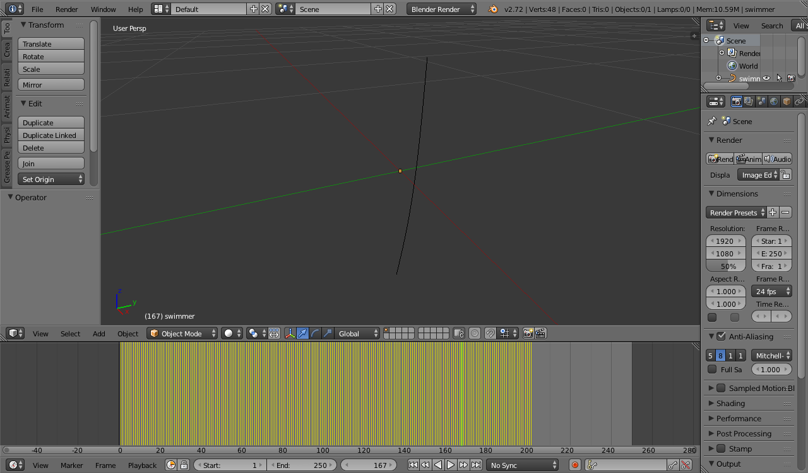

Description of the interface
=====================
This version of the interface can only place a NURBS curve inside a blender object. 
The coordinates must be provided through a list which contain every frame and in each frame are described the coordinates of each control point of the NURBS.

Ideal Workflow
===========

1.	Do a "Motion capture" of the shape. Inside this folder I have provided a tracking_template.blend in which I have tracked five points.

2.	Open blender and import the interface. Then in the python shell run:
	
		clear_scene()
		
	and
	
		enable_AnimALL()
		
	to enable the AnimALL plugin

3.	Get the tracked coordinates inside a variable.

		coords = sample_ortogonal_camera_solver(get_tracked_coords())
		
	if you want you can save the coordinates inside a file with:
	
		 write_to_file_coords(coords,filename="sample.shape")

4.	Create the CompositeObject	

		swimmer = CompositeObject.load_from_file("sample.shape","sample.pos","swimmer")
	
5.	Place the object in the scene:

		swimmer.pose_object()
		
6.	Animate:

		animate_CO(swimmer)
		

Known Issues
=============
* There are some commands that may need to be runned two times for example:

		enable_AnimALL()

* animate_CO doesn't work if the script is launched through blender for example: 

		blender --python interface_example.py

* There are no consistent sanity checks inside the functions.
